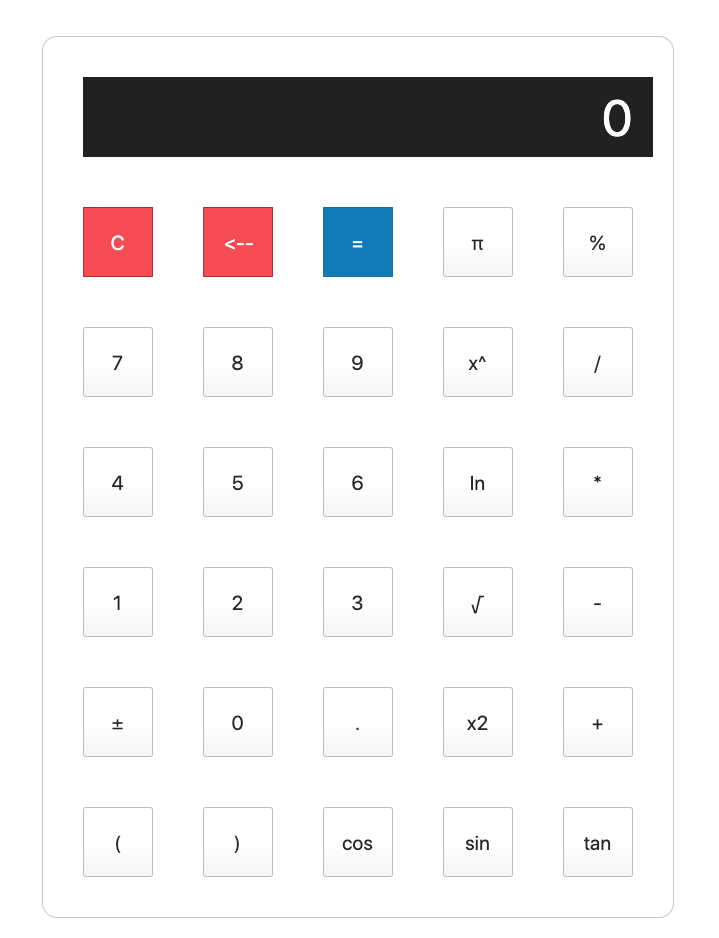

# Calculator

A calculator app that performs mathematical operations on number. The app handles simple arithmetic operations like addition, substraction, multiplication and division. It also does other mathematical calculations like exponential, cosinus, sinus, natural logarithm etc.

# Project Sceen Shot

# Languages and Frameworks 
    JavaScript
    HTML
    CSS

# Installation and Setup Instructions

Clone/fork down this repository. To run the app simple:
    cd Calculator
    run open index.html

# Reflection

This was a  1 week long project built during my third module at Flatiron School. Project goals included using technologies learned up until this point and familiarizing myself with documentation for new features.The technologies implemented in this project where plain Javascript with HTML5 and CSS.

